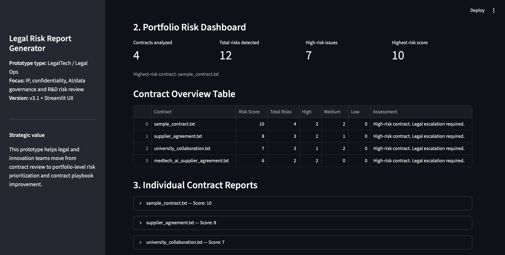

# Legal Risk Report Generator

## Overview

Legal Risk Report Generator is a rule-based LegalTech prototype designed to analyze contract text files and identify recurring legal risks related to intellectual property, confidentiality, AI/data governance and R&D collaboration.

The tool generates individual contract reports, a portfolio-level batch summary, risk scoring, priority recommendations, action plans and contract playbook recommendations.

## Why This Project Matters

Legal teams increasingly need to move beyond document-by-document review and toward portfolio-level risk governance.

This prototype demonstrates how legal analysis can be transformed into a structured workflow:

```text
contract review → risk detection → scoring → prioritization → action plan → playbook improvement
```

The project is especially relevant for technology-driven companies dealing with R&D collaborations, supplier agreements, confidential technical data and AI-related data use risks.

## Current Version

Version: `v3.2`

Status: Streamlit-based LegalTech prototype with file upload, batch contract review, risk scoring, strategic insights, portfolio action planning and contract playbook recommendations.

## Key Features

- Streamlit web interface
- File upload interface for `.txt` contracts
- Existing file selection from the `inputs/` folder
- Multiple contract file analysis
- Portfolio risk dashboard
- Individual contract reports
- Batch summary report
- Downloadable Markdown reports
- Contract risk scoring and ranking
- Priority recommendation
- Risk category summary
- Strategic category insights
- Portfolio action plan by owner
- Priority-sorted action items
- Contract playbook recommendations

## Streamlit Demo

The project includes a Streamlit web interface for browser-based contract risk analysis.



Users can:

- select existing `.txt` contracts from the `inputs/` folder;
- upload new `.txt` contract files directly through the interface;
- run automated legal risk analysis;
- view a portfolio-level risk dashboard;
- review individual contract reports;
- generate a batch summary report;
- download Markdown reports.

## How to Run

The project can be used in two ways:

- **Streamlit web app** — recommended for demos and user testing.
- **Command-line version** — useful for development and batch generation.

### Prerequisites

Make sure Python is installed:

```bash
python3 --version
```

Install the required packages:

```bash
python3 -m pip install -r requirements.txt
```

### Option 1 — Streamlit Web App

From the project folder, run:

```bash
streamlit run app.py
```

If needed, use:

```bash
python3 -m streamlit run app.py
```

Then open the local URL shown in the terminal, usually:

```text
http://localhost:8501
```

The Streamlit interface lets users select existing `.txt` files, upload new `.txt` contracts, view the risk dashboard and download Markdown reports.

### Option 2 — Command-Line Version

To analyze `.txt` files stored in the `inputs/` folder and generate reports in `Outputs/`, run:

```bash
python3 main.py
```

## Example Use Case

A legal, IP or innovation team can use this tool to review multiple R&D, supplier or collaboration agreements before signature.

For example, the tool can help identify recurring issues such as:

- unclear foreground IP ownership;
- missing confidentiality survival obligations;
- unrestricted AI training use of technical data;
- missing publication approval mechanisms.

The batch report helps the team prioritize legal review, assign action items by owner and improve the company’s contract playbook.

## Example Output

The tool generates:

- individual Markdown reports for each contract;
- a portfolio-level batch summary report;
- a risk dashboard in the Streamlit interface;
- downloadable Markdown reports.

Example output files:

```text
Outputs/sample_contract_report.md
Outputs/supplier_agreement_report.md
Outputs/university_collaboration_report.md
Outputs/batch_summary_report.md
```

## Project Structure

```text
02_legal_risk_report_generator/
├── app.py
├── main.py
├── data.py
├── file_reader.py
├── input_analyzer.py
├── risk_engine.py
├── report_generator.py
├── export.py
├── requirements.txt
├── inputs/
│   ├── sample_contract.txt
│   ├── supplier_agreement.txt
│   ├── university_collaboration.txt
    └── medtech_ai_supplier_agreement.txt
├── Outputs/
│   ├── sample_contract_report.md
│   ├── supplier_agreement_report.md
│   ├── university_collaboration_report.md
│   └── batch_summary_report.md
├── README.md
└── .gitignore
```

## Roadmap

Potential next steps:

- support `.docx` and `.pdf` contract inputs;
- export reports to PDF or DOCX;
- add clause-level recommendations;
- integrate LLM-based contract analysis;
- add risk visualization charts;
- deploy the Streamlit app online;
- develop an AI legal agent workflow.

## Skills Demonstrated

This project demonstrates:

- Python programming fundamentals;
- modular code architecture;
- rule-based legal risk analysis;
- contract risk scoring;
- legal operations workflow design;
- Streamlit web app development;
- Git and GitHub version control;
- applied understanding of IP, confidentiality and AI/data governance risks.

## Legal Disclaimer

This project is a prototype for educational and portfolio purposes.

It does not provide legal advice and should not be used as a substitute for review by a qualified legal professional.